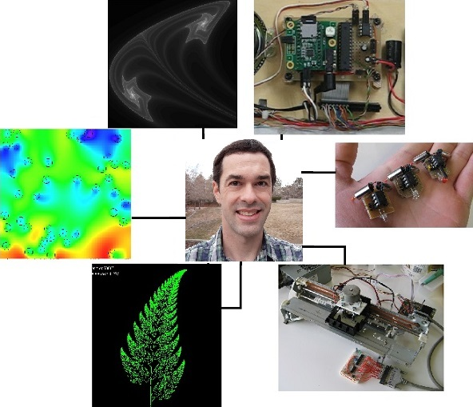

## About me

I'm a maker of many things. This usually involves mathematical software, electronics, machines, robots, microcontrollers, math modeling, woodworking, baking, 3D printing, gardening, etc. I am currently a computer science PhD student at the University of Utah learning more about making things.