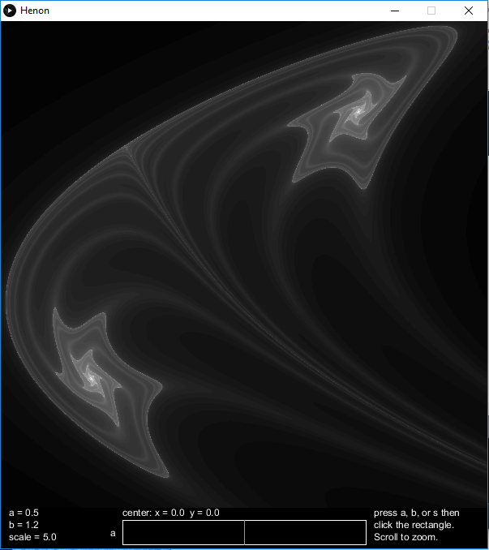
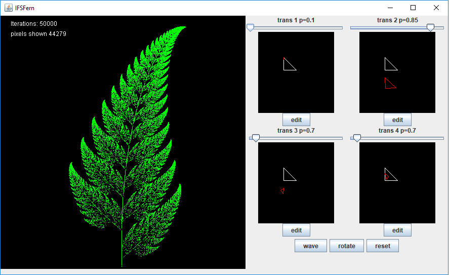
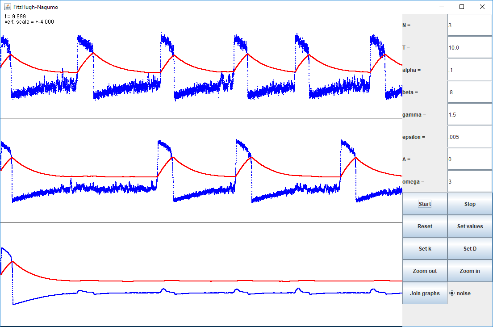
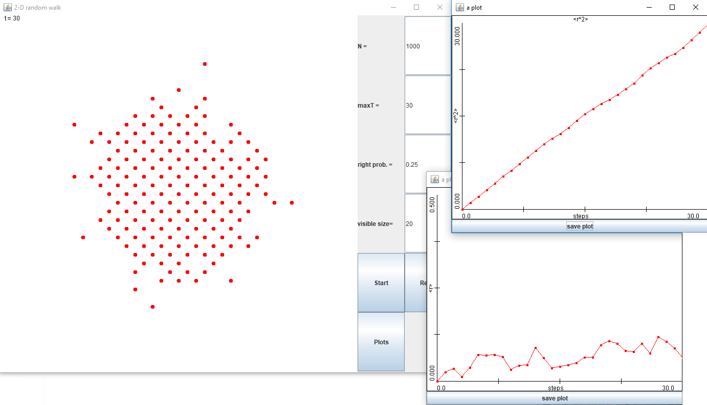
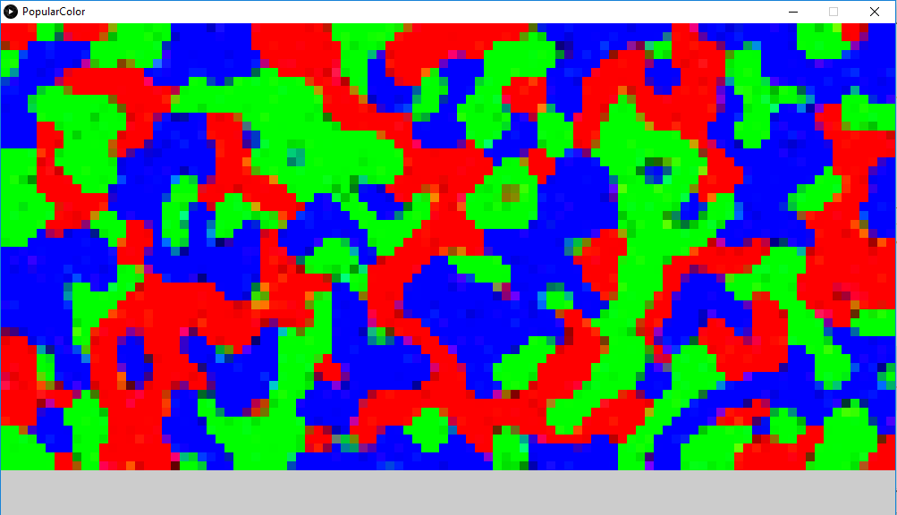
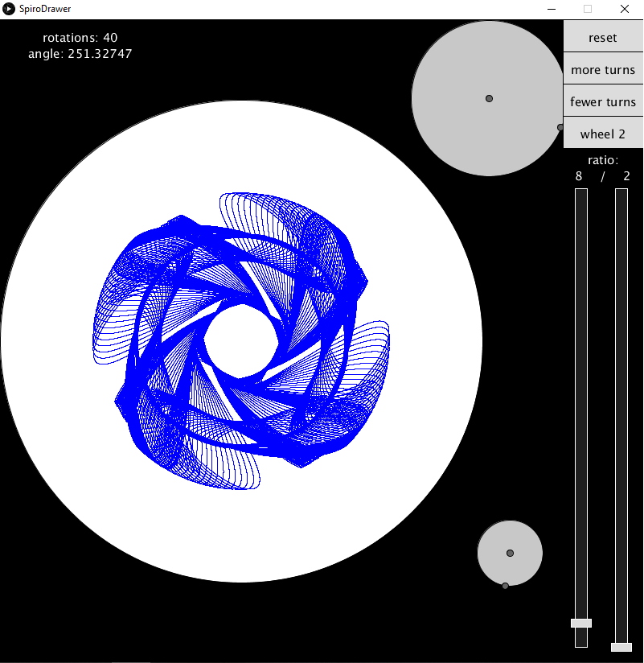
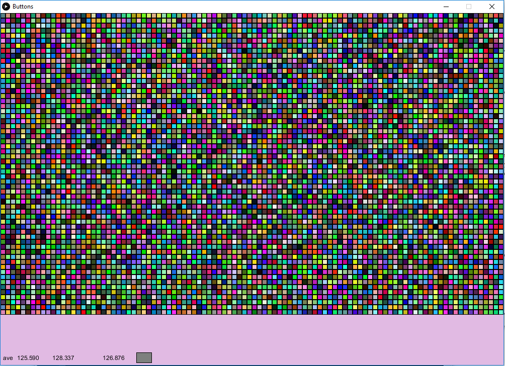
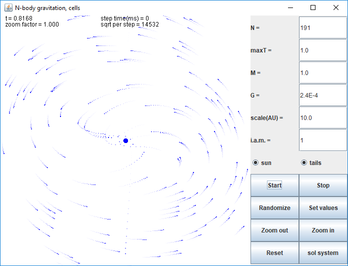

## Math and art in bite-sized apps

Back in the day I wrote dozens of simple applets based on math models, physics simulations, and other things that just looked cool. Then browsers stopped supporting applets... I've since reworked some of them into usable, though less convenient, forms. I'll give you the code for the ones that have been reworked, though most of it is very rough since these are not serious projects, but just fun distractions. Some of them were just made to practice new programming or modeling techniques.

Disclaimer: These are all very old and poorly written. Now that I teach programming, I can see just how bad the code quality is. Live, learn, and never let lack of skill stop you.

<h3>Henon basin of attraction</h3> 

 
The Henon map attractor is old hat, but the structure around the basin of attraction is fun to play with. Slide the parameters around or zoom through the fractal structure.
 <a href="https://github.com/ericheisler/MathArtBits/tree/master/henon">The repository</a> with Processing sketch, Java code, and windows application.
 
 
 

<h3>Iterated function system</h3>

 
Start out with a classical Barnsley fern and visually modify each of the functions or make an animation. It beautifully demonstrates the continuous property of the fractal with respect to the parameters.
 <a href="https://github.com/ericheisler/MathArtBits/tree/master/ifsfern">The repository</a> with the Java code.

<h3>Coupled, noisy, n-channel FitzHugh-Nagumo simulation</h3>

 
Explore stochastic resonance and coupled excitable systems with this simulation. See if you can find the set of parameters that causes a period-doubling bifurcation, which looks really cool. 
 <a href="https://github.com/ericheisler/MathArtBits/tree/master/FitzHughNagumo">The repository</a> with the Java code.

<h3>2-D random walk of an ensemble of particles</h3>

 
Perform a 2-D random walk with any number of particles, then plot the statistics to confirm the results your textbook gives. There is also a version with memory, meaning there is an adjustable probability to step the same way as the last step. These statistics are more difficult, but not impossible, to find an analytical solution for.
 <a href="https://github.com/ericheisler/MathArtBits/tree/master/2Drandomwalk">The repository</a> with the Java code.

<h3>RGB politics</h3>

 
Start with a random grid of colors. Let their RGB values be influenced by their neighbors such that they tend toward the color(red, green or blue) that is most prominent around them. It will evolve toward an irregular equilibrium pattern. Then click to randomize it again. It happens extremely fast, so I slowed the evolution way down to make it observable.
 <a href="https://github.com/ericheisler/MathArtBits/tree/master/PopularColor">The repository</a> with Processing sketch, Java code, and windows application.

<h3>Spirograph? Harmonograph? What exactly is it?</h3>

 
Build a virtual harmonograph and play around with parameters before you try building a physical one. It can produce some really cool patterns.
 <a href="https://github.com/ericheisler/MathArtBits/tree/master/SpiroDrawer">The repository</a> with Processing sketch, Java code, and windows application.
 
 
 

<h3>Patterns in noise</h3>

 
Look at some random noise and you will find faces and other common patterns. Your brain is extremely good at this. Here you can do it with color. Generate a grid of randomly colored squares(pixels are too small), and see what you can see.
 <a href="https://github.com/ericheisler/MathArtBits/tree/master/Buttons">The repository</a> with Processing sketch, Java code, and windows application.

<h3>N-body gravity simulation</h3>

 
A couple different implementations of N-body gravitation simulations. They are by no means useful for scientific purposes, but they are fun to play with. 
 <a href="https://github.com/ericheisler/MathArtBits/tree/master/Nbody">The repository</a> with the Java code.
 
 

