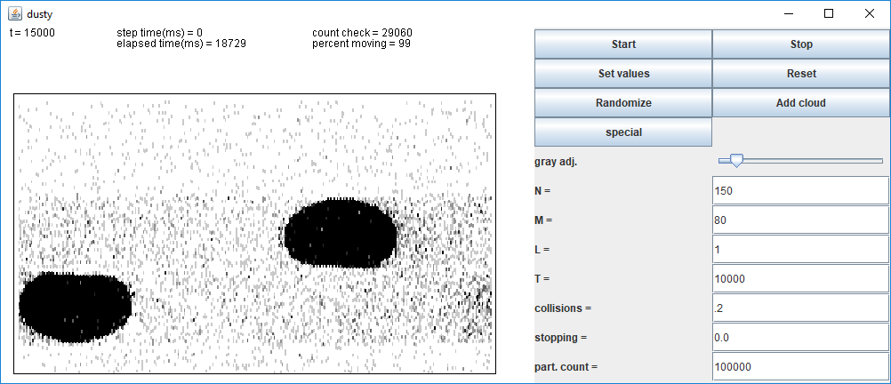

## Math and art in bite-sized apps

Back in the day I wrote dozens of simple applets based on math models, physics simulations, and other things that just looked cool. Then browsers stopped supporting applets... I've since reworked some of them into usable, though less convenient, forms. I'll give you the code for the ones that have been reworked, though most of it is very rough since these are not serious projects, but just fun distractions. Some of them were just made to practice new programming or modeling techniques.

<h3>Henon basin of attraction</h3> 

 
The Henon map attractor is old hat, but the structure around the basin of attraction is fun to play with. Slide the parameters around or zoom through the fractal structure.
 <a href="b">Stuff</a> things

<h3>Iterated function system</h3>

 
Start out with a classical Barnsley fern and visually modify each of the functions or make an animation. It beautifully demonstrates the continuous property of the fractal with respect to the parameters.
 <a href="b">Stuff</a> things

<h3>Coupled, noisy, n-channel FitzHugh-Nagumo simulation</h3>

 
Explore stochastic resonance and coupled excitable systems with this simulation. See if you can find the set of parameters that causes a period-doubling bifurcation, which looks really cool. 
 <a href="b">Stuff</a> things

<h3>N-body gravity simulation</h3>

 
A couple different implementations of N-body gravitation simulations. They are by no means useful for scientific purposes, but they are fun to play with. 
 <a href="b">Stuff</a> things

<h3>2-D random walk of an ensemble of particles</h3>

 
Perform a 2-D random walk with any number of particles, then plot the statistics to confirm the results your textbook gives. There is also a version with memory, meaning there is an adjustable probability to step the same way as the last step. These statistics are more difficult, but not impossible, to find an analytical solution for.
 <a href="b">Stuff</a> things

<h3>Space dust cloud simulation</h3>

 
Make clouds of many particles and collide them. This is not very physically accurate, but it can look interesting.
 <a href="b">Stuff</a> things

