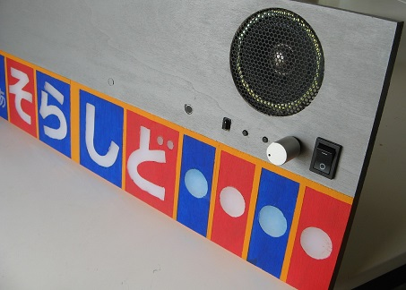
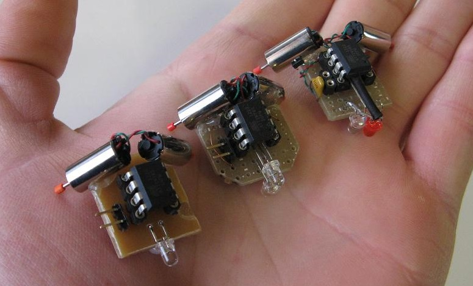
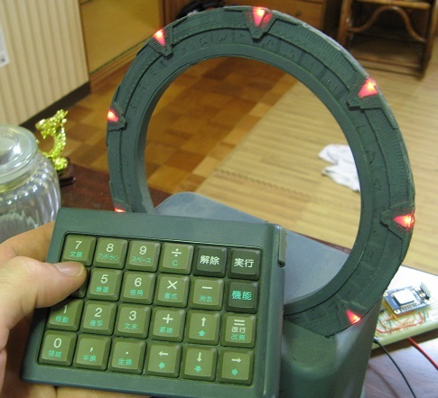
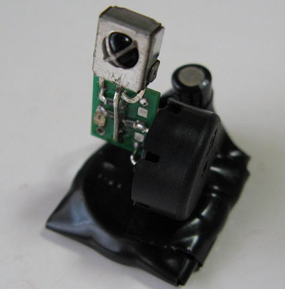
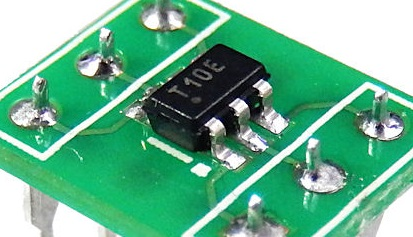
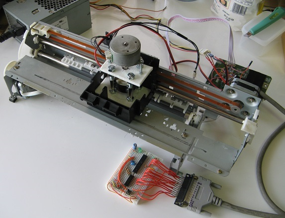
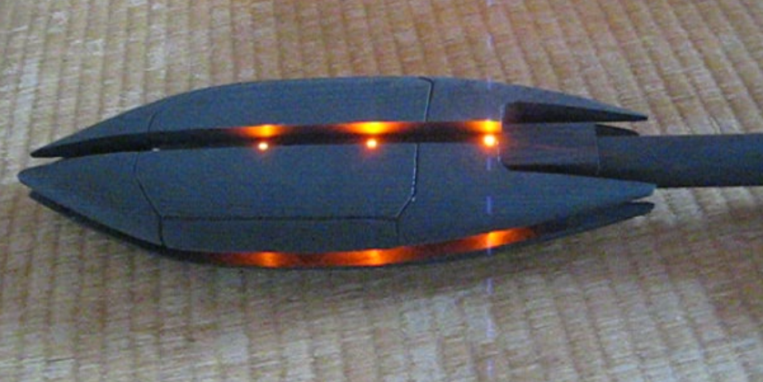
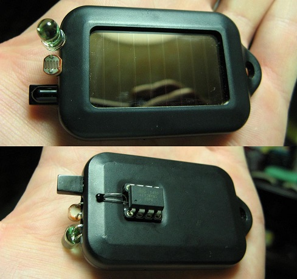

## A few of my projects

These are just some of my more documented projects. There are more on <a href="https://hackaday.io/projects/hacker/894">my hackaday.io page</a>, and many more still that haven't quite made it to the internet.

<h3>Classroom music teaching aid</h3> 

 
A device that processes audio input and provides real time visual feedback. It also features wireless control, audio output, and a unique LED display concept.
 <a href="https://hackaday.io/project/9657-classroom-music-teaching-aid">The hackaday.io project page</a> with detailed build log, components, demos, images, etc.
 <a href="https://github.com/ericheisler/MusicTeachingAid">The GitHub repository</a> with code and diagrams.

<h3>Tiny robot family</h3>

 
Three fun tiny robots that run around sensing their environment and communicating with each other in different ways. They were intended as a very simple, cheap and satisfying robotics project. They were also used as an electronics and programming workshop at the HackaDay 10th anniversary event.
 <a href="https://hackaday.io/project/581-tiny-robot-family">The hackaday.io project page</a> with schematics, video, and pictures.
 <a href="https://github.com/ericheisler/TinyRobotFamily">The GitHub repository</a> with code.

<h3>Stargate</h3>

 
A handmade plastic stargate that rotates and lights up when dialing or being dialed to. It also has a dialing remote and communicates via internet to another virtual stargate. 
 <a href="https://hackaday.io/project/596-a-functional-stargate">The hackaday.io project page</a> with extensive details on the build process and videos.
 <a href="https://github.com/ericheisler/FunctionalStargate">The GitHub repository</a> with code for the stargate, dialer and remote virtual gate as well as all the sound effects.

<h3>Small prank device with ATtiny10</h3>

 
A prank which listens for remote control signals, records them, repeats them 30 seconds later, then plays a delightful tune. It was hand coded entirely in assembly and utilizes almost every available byte on an ATtiny10 microcontroller.
 <a href="https://hackaday.io/project/29310-attiny10-rickroller">The hackaday.io project page</a> with circuit details and video.
 <a href="https://github.com/ericheisler/ATtiny10Prank">The GitHub repository</a> with code and schematic.

<h3>ATtiny10 programmer using Arduino</h3>

 
There were not many resources available for programming ATtiny10 microcontrollers when I started working with them, so I made my own Arduino-based programmer and shared it with the world. It has since been adopted and improved by others, and it is still what I use to work with these tiny chips.
 <a href="https://hackaday.io/project/161091-attiny10-resources">The hackaday.io project page</a> with hardware details, programmer code and several useful example programs written in assembly.
 <a href="https://github.com/ericheisler/ATtiny10Programmer">The GitHub repository</a> with programmer code and example programs.

<h3>$10 pcb mill made from recycled electronics</h3>

 
A crude yet effective pcb mill built from an old printer and other scrap electronics. The total cost for new parts was about $10. It reads an SVG vector graphics file and generates tool paths that are sent to the mill controller which was cobbled together from scraps.
 <a href="https://hackaday.io/project/283-pcb-mill-for-under-10">The hackaday.io project page</a> with build details, video, code, schematics, etc.
 <a href="https://github.com/ericheisler/PCBMill">The GitHub repository</a> with code and other files.

<h3>Crosshatching software for pen plotters and a mini plotter</h3>

 
A crosshatching algorithm to add shading ability to pen plotters. I also made a very small plotter from recycled electronics to make use of the software. The results look very nice, but it adds a lot of time to the drawing process.
 <a href="https://hackaday.io/project/20585-upgrade-for-your-diy-plotters">The hackaday.io project page</a> with description of the algorithm, build details for the plotter and video.
 <a href="https://github.com/ericheisler/CrosshatchingPlotter">The GitHub repository</a> with code and examples.

<h3>Automated art knitting machine</h3>

 
An automated implementation of <a href="http://artof01.com/vrellis/works/knit.html">Petros Vrellis's knit art</a>. It approximates an image using only straight black lines, then knits black thread on a circular loom to produce the art. It is much easier to just show you than to explain it, so please look at the project page.
 <a href="https://hackaday.io/project/13047-automate-the-art">The hackaday.io project page</a> with a much better explanation, video, build details, results.
 <a href="https://github.com/ericheisler/AutomatedArt">The GitHub repository</a> with code and other files.

<h3>Ma'Tok staff weapon prop with lights and projectiles</h3>

 
A prop from Stargate. It's a staff with an illuminated head that lights up in various patterns and fires a small projectile. Watch the video for a demonstration.
 <a href="https://hackaday.io/project/19722-matok-staff-weapon-from-stargate">The hackaday.io project page</a> with build details, video, schematics, etc.
 <a href="https://github.com/ericheisler/StaffWeapon">The GitHub repository</a> with code and schematic.

<h3>Social, wireless, solar sensor network</h3>

 
A novel idea for a collection of sensor modules placed around the room that talk to each other and discuss their environment while building relationships that favor modules in more ideal locations. Only two modules were actually built before the project was set aside.
 <a href="https://hackaday.io/project/2160-a-society-of-things">The hackaday.io project page</a> with build details, videos, schematics, etc.
 <a href="https://github.com/ericheisler/SocietyOfThings">The GitHub repository</a> with code.

 